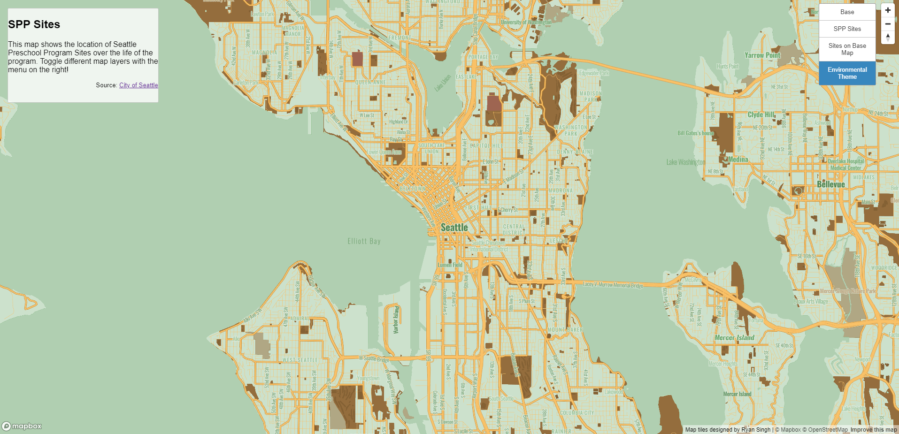

# SPP Map Tiles

<a href="https://rsingh802.github.io/SPP-Map-Tiles/">Link to Map</a>

### Tileset 1

<ul>
    <li>Description: Custom version of the monochromatic basemap. Fonts changed to a softer font family. Greenspaces are displayed in light blue to stand out while still keeping with the blue theme.</li>
    <li>Geographic area: The city of Seattle, Washington.</li>
    <li>Available zoom levels: Min = 10; Max = 14</li>
</ul>

### Tileset 2

<ul>
    <li>Description: Dot icons on areas that have been a sight for the Seattle Preschool Program. Layer is on top of the Mapbox basemap.</li>
    <li>Geographic area: The city of Seattle, Washington.</li>
    <li>Available zoom levels: Min = 10; Max = 14</li>
</ul>

### Tileset 3

<ul>
    <li>Description: Dot icons on areas that have been a sight for the Seattle Preschool Program. Layer is on top of the custom basemap from tileset 1.</li>
    <li>Geographic area: The city of Seattle, Washington.</li>
    <li>Available zoom levels: Min = 10; Max = 14</li>
</ul>

### Tileset 4

<ul>
    <li>Description: Tileset created inspired by an environmental theme. Primary green color to represent plants and brown to contrast with landmarks and roads.</li>
    <li>Geographic area: The city of Seattle, Washington.</li>
    <li>Available zoom levels: Min = 10; Max = 14</li>
</ul>